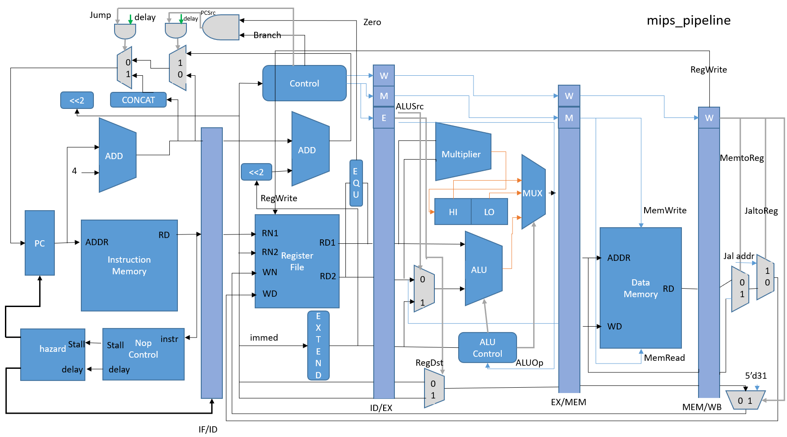

# MIPS Pipeline CPU

這是一個使用 Verilog 實作的 32-bit MIPS pipeline CPU。設計以五階段管線為主體，包含 instruction fetch、decode、execute、memory access 與 write back，並加入基本 stall 控制、branch/jump PC 選擇，以及 `multu` / `maddu` 對應的 Hi/Lo 暫存器資料路徑。

```mermaid
flowchart LR
    IF --> ID --> EX --> MEM --> WB

## Architecture



## Features

- 32-bit MIPS datapath with four pipeline registers: `IFID`, `IDEX`, `EXMEM`, `MEMWB`.
- Separate instruction memory and data memory instances using the same `memory` module.
- Register file with two read ports and one write port; register `$zero` always reads as zero.
- ALU supports arithmetic, logic, set-less-than, and logical right shift.
- Multiplier path supports `multu` and `maddu`, with result stored through the `HiLo` module.
- Basic control flow support for `beq` and `j`.
- `nopControl` and `hazard` gate `PC` / `IFID` writes for branch, jump, and multiply-related delay handling.

## Supported Instructions

| Instruction | Type | Opcode | Funct | Main modules |
| --- | --- | ---: | ---: | --- |
| `add` | R | `0` | `32` | `control_unit`, `alu_ctl`, `ALU` |
| `sub` | R | `0` | `34` | `control_unit`, `alu_ctl`, `ALU` |
| `and` | R | `0` | `36` | `control_unit`, `alu_ctl`, `ALU` |
| `or` | R | `0` | `37` | `control_unit`, `alu_ctl`, `ALU` |
| `slt` | R | `0` | `42` | `control_unit`, `alu_ctl`, `ALU` |
| `srl` | R | `0` | `2` | `control_unit`, `alu_ctl`, `Shifter` |
| `multu` | R | `0` | `25` | `alu_ctl`, `MPY`, `HiLo` |
| `mfhi` | R | `0` | `16` | `alu_ctl`, `HiLo`, `TotalALU_MUX` |
| `mflo` | R | `0` | `18` | `alu_ctl`, `HiLo`, `TotalALU_MUX` |
| `lw` | I | `35` | - | `control_unit`, `memory`, `MEMWB` |
| `sw` | I | `43` | - | `control_unit`, `memory` |
| `beq` | I | `4` | - | `b_eq`, `control_unit`, PC mux |
| `addiu` | I | `9` | - | `control_unit`, `ALU` |
| `j` | J | `2` | - | `control_unit`, jump address path |
| `maddu` | SPECIAL2 | `28` | `1` | `alu_ctl`, `MPY`, `HiLo` |

## Source Layout

```text
.
├── mips_pipeline_cpu.png          # CPU architecture diagram
├── README.md
└── CPU_pipeline_latest/
    ├── mips_pipeline.v            # top module
    ├── tb_Pipeline.v              # simulation testbench
    ├── instr_mem.txt              # instruction memory image
    ├── data_mem.txt               # data memory image
    ├── reg.txt                    # register initial values
    ├── IFID.v / IDEX.v / EXMEM.v / MEMWB.v
    ├── control_unit.v / alu_ctl.v
    ├── TotalALU.v / ALU.v / MPY.v / HiLo.v / Shifter.v
    └── mux, register, adder, memory helper modules
```

## Pipeline Overview

1. `IF` reads instruction memory by `PC`, computes `PC + 4`, and selects the next PC from sequential, branch, or jump paths.
2. `ID` decodes instruction fields, reads the register file, generates control signals, sign-extends immediates, and checks `beq` equality.
3. `EX` chooses register or immediate ALU input, executes ALU / shift / multiply operations, and chooses the destination register.
4. `MEM` performs data memory read/write for `lw` and `sw`.
5. `WB` selects ALU result or memory data and writes it back to the register file.

## Simulation

This project already includes ModelSim/Quartus-style simulation files. From the source directory:

```tcl
cd CPU_pipeline_latest
vlog ALU_bit.v add32.v b_eq.v ALU.v control_unit.v alu_ctl.v EXMEM.v FA.v HiLo.v IFID.v IDEX.v memory.v MEMWB.v MPY.v mux2.v MUX.v MUX_5BIT.v mux2to1.v Mux_alu.v nop.v nopControl.v reg_file.v reg32.v Shifter.v "sign extend.v" TotalALU.v TotalALU_MUX.v mips_pipeline.v tb_Pipeline.v
vsim tb_Pipeline
run -all
```

The testbench loads:

- `instr_mem.txt` into `CPU.InstrMem.mem_array`
- `data_mem.txt` into `CPU.DatMem.mem_array`
- `reg.txt` into `CPU.RegFile.file_array`

`tb_Pipeline.v` generates a 10 ns clock period, releases reset after 10 ns, and stops after 200 cycles.

## Notes

- The supported instruction list above is based on the current Verilog implementation.
- The architecture diagram contains extra write-back labels such as `JalToReg`; the current `control_unit.v` implements `j`, but does not implement a complete `jal` write-back path.
- This design uses stall/delay logic for selected hazards. A full forwarding unit is not present in the current source.
